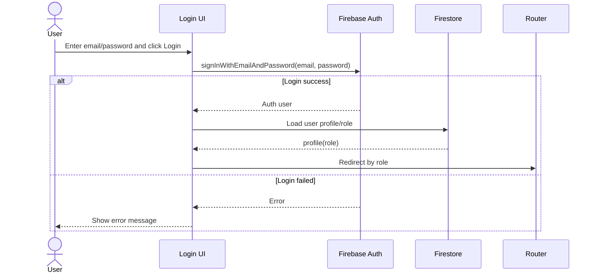
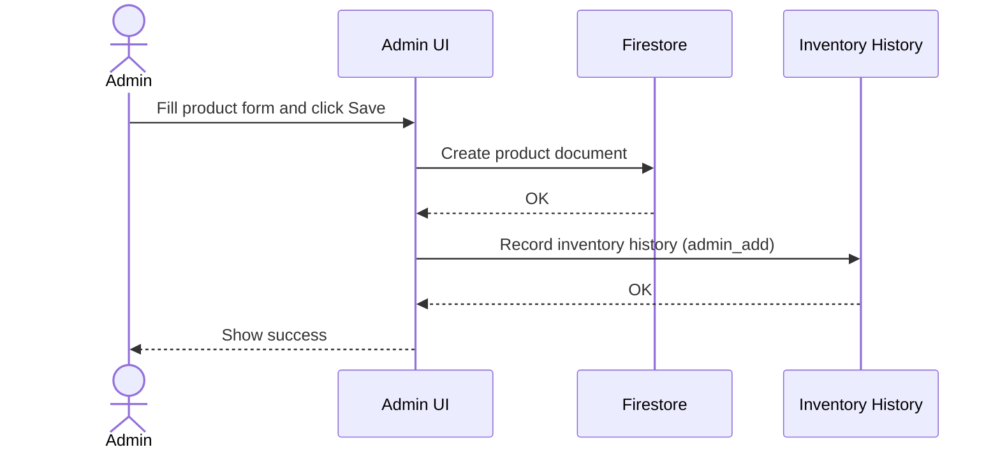
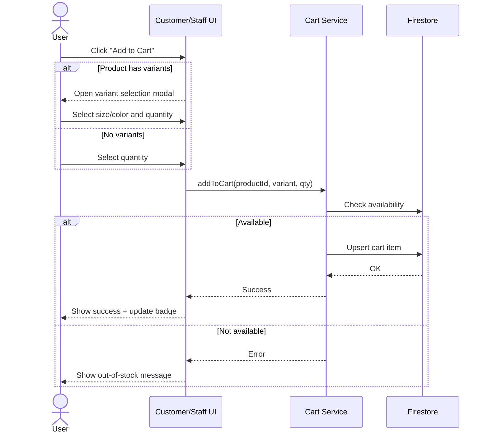
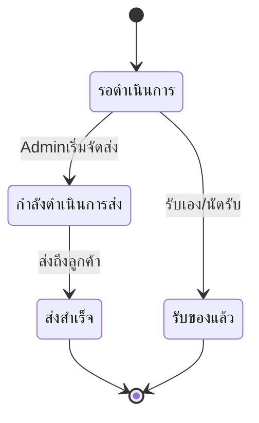
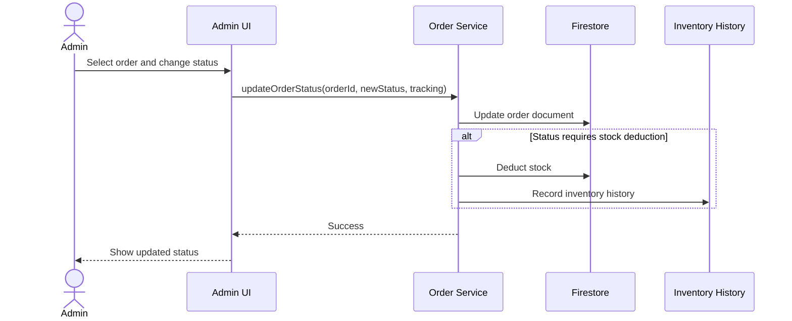
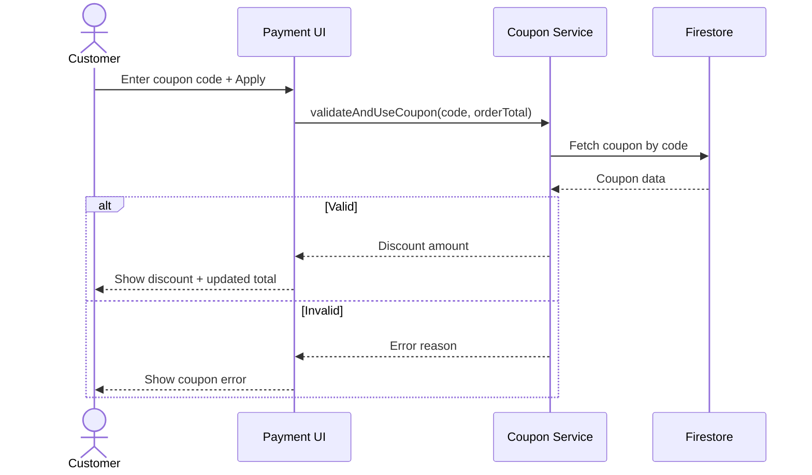
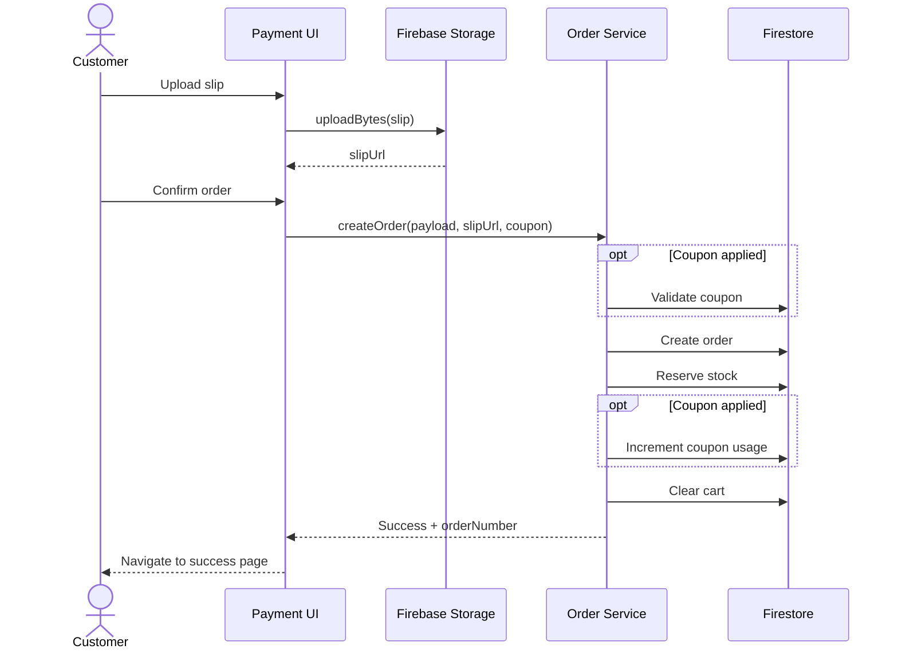
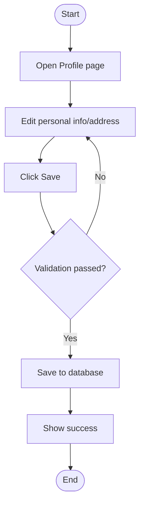
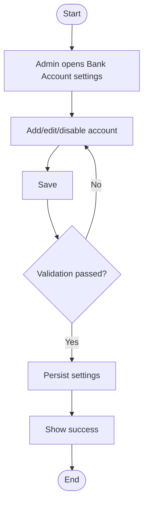
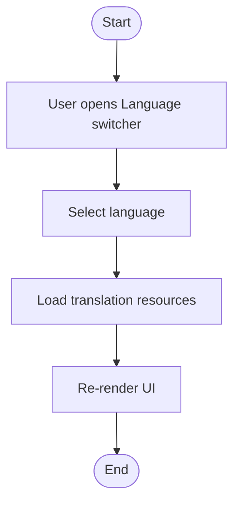

# 4. System Features (คุณสมบัติของระบบ)

## 4.1 ภาพรวมคุณสมบัติระบบ

```
┌─────────────────────────────────────────────────────────────────────┐
│                    InventoryPro System Features                      │
├─────────────────────────────────────────────────────────────────────┤
│                                                                       │
│  ┌─────────────────┐  ┌─────────────────┐  ┌─────────────────┐      │
│  │  Authentication │  │    Products     │  │    Inventory    │      │
│  │  & Authorization│  │   Management    │  │   Management    │      │
│  └────────┬────────┘  └────────┬────────┘  └────────┬────────┘      │
│           │                    │                    │                │
│  ┌────────┴────────┐  ┌────────┴────────┐  ┌────────┴────────┐      │
│  │  • Login        │  │  • Add Product  │  │  • Track Stock  │      │
│  │  • Register     │  │  • Edit Product │  │  • Low Stock    │      │
│  │  • Logout       │  │  • Delete       │  │    Alerts       │      │
│  │  • Role-based   │  │  • Variants     │  │  • History      │      │
│  │    Access       │  │  • Promotions   │  │                 │      │
│  └─────────────────┘  └─────────────────┘  └─────────────────┘      │
│                                                                       │
│  ┌─────────────────┐  ┌─────────────────┐  ┌─────────────────┐      │
│  │   Shopping      │  │     Orders      │  │    Payments     │      │
│  │     Cart        │  │   Management    │  │   & Coupons     │      │
│  └────────┬────────┘  └────────┬────────┘  └────────┬────────┘      │
│           │                    │                    │                │
│  ┌────────┴────────┐  ┌────────┴────────┐  ┌────────┴────────┐      │
│  │  • Add to Cart  │  │  • Create Order │  │  • Bank Transfer│      │
│  │  • Update Qty   │  │  • Track Status │  │  • Upload Slip  │      │
│  │  • Remove Item  │  │  • Update Status│  │  • Apply Coupon │      │
│  │  • Checkout     │  │  • Order History│  │  • Manage       │      │
│  │                 │  │                 │  │    Coupons      │      │
│  └─────────────────┘  └─────────────────┘  └─────────────────┘      │
│                                                                       │
│  ┌─────────────────┐  ┌─────────────────┐  ┌─────────────────┐      │
│  │     Users       │  │    Reports      │  │    Settings     │      │
│  │   Management    │  │   & Dashboard   │  │                 │      │
│  └────────┬────────┘  └────────┬────────┘  └────────┬────────┘      │
│           │                    │                    │                │
│  ┌────────┴────────┐  ┌────────┴────────┐  ┌────────┴────────┐      │
│  │  • View Users   │  │  • Overview     │  │  • Bank Account │      │
│  │  • Change Role  │  │  • Sales Stats  │  │  • Profile      │      │
│  │  • Profile      │  │  • Top Products │  │  • Language     │      │
│  │  • Addresses    │  │  • Alerts       │  │  • Password     │      │
│  └─────────────────┘  └─────────────────┘  └─────────────────┘      │
│                                                                       │
└─────────────────────────────────────────────────────────────────────┘
```

---

## 4.2 Feature 1: Authentication & Authorization

### 4.2.1 รายละเอียดฟีเจอร์

| หัวข้อ | รายละเอียด |
|--------|------------|
| **Feature ID** | F01 |
| **Feature Name** | Authentication & Authorization |
| **Description** | ระบบยืนยันตัวตนและจัดการสิทธิ์การเข้าถึง |
| **Priority** | Critical |
| **Related Pages** | LoginPage, RegisterPage, ProtectedRoute |

### 4.2.2 Sub-features

| Sub-feature | Description |
|-------------|-------------|
| **Login** | เข้าสู่ระบบด้วย Email/Password |
| **Register** | ลงทะเบียนผู้ใช้ใหม่ |
| **Logout** | ออกจากระบบ |
| **Role-based Access** | ควบคุมการเข้าถึงตาม Role (Admin/Staff/Customer) |
| **Auto Redirect** | Redirect ไปหน้าที่เหมาะสมตาม Role |

### 4.2.3 Use Cases

#### UC-AUTH-01: User Login

```
┌─────────────────────────────────────────────────────────────┐
│ Use Case: User Login                                         │
├─────────────────────────────────────────────────────────────┤
│ Actor: User (Admin/Staff/Customer)                           │
│ Pre-condition: User has an account                           │
│ Post-condition: User is logged in and redirected             │
├─────────────────────────────────────────────────────────────┤
│ Main Flow:                                                   │
│ 1. User navigates to /login                                  │
│ 2. User enters email and password                            │
│ 3. User clicks "Login" button                                │
│ 4. System validates credentials                              │
│ 5. System creates session                                    │
│ 6. System redirects based on role:                           │
│    - Admin → /admin/dashboard                                │
│    - Staff → /staff                                          │
│    - Customer → /customer                                    │
├─────────────────────────────────────────────────────────────┤
│ Alternative Flow:                                            │
│ 4a. Invalid credentials:                                     │
│     - System shows error message                             │
│     - User remains on login page                             │
└─────────────────────────────────────────────────────────────┘
```

#### UC-AUTH-02: User Registration

```
┌─────────────────────────────────────────────────────────────┐
│ Use Case: User Registration                                  │
├─────────────────────────────────────────────────────────────┤
│ Actor: New User                                              │
│ Pre-condition: Email not already registered                  │
│ Post-condition: New account created with "customer" role     │
├─────────────────────────────────────────────────────────────┤
│ Main Flow:                                                   │
│ 1. User navigates to /register                               │
│ 2. User enters email, password, confirm password             │
│ 3. User clicks "Register" button                             │
│ 4. System validates input                                    │
│ 5. System creates Firebase Auth account                      │
│ 6. System creates user profile in Firestore                  │
│ 7. System logs in user automatically                         │
│ 8. System redirects to /customer                             │
├─────────────────────────────────────────────────────────────┤
│ Alternative Flow:                                            │
│ 4a. Email already exists:                                    │
│     - System shows error message                             │
│ 4b. Passwords don't match:                                   │
│     - System shows error message                             │
└─────────────────────────────────────────────────────────────┘
```

### 4.2.4 Functional Requirements (Authentication & Authorization)

| Requirement ID | Requirement (shall statement) | Priority |
|---|---|---|
| **FR-AUTH-001** | The system shall allow a user to register with Email and Password. | Critical |
| **FR-AUTH-002** | The system shall validate registration inputs and reject invalid data (e.g., email format, password mismatch). | Critical |
| **FR-AUTH-003** | The system shall prevent registration with an email that already exists. | Critical |
| **FR-AUTH-004** | The system shall allow a registered user to login with Email and Password. | Critical |
| **FR-AUTH-005** | The system shall show an error message when login credentials are invalid. | High |
| **FR-AUTH-006** | The system shall enforce role-based access control for protected routes. | Critical |
| **FR-AUTH-007** | After successful login, the system shall redirect users to the appropriate home route based on their role. | High |
| **FR-AUTH-008** | The system shall allow a logged-in user to logout and end the active session. | High |

### 4.2.5 User Stories (Authentication & Authorization)

| Story ID | User Story | Acceptance Criteria (summary) |
|---|---|---|
| **US-AUTH-01** | As a user, I want to register so that I can access the system. | Email must be unique; password and confirm password must match; successful registration redirects to the customer home. |
| **US-AUTH-02** | As a user, I want to login so that I can use the system according to my role. | Invalid credentials show an error; successful login redirects based on role. |
| **US-AUTH-03** | As a user, I want to be blocked from pages I do not have permission for. | Access is denied/redirected when role does not match required role. |

### 4.2.6 Sequence Diagram (Login)



---

## 4.3 Feature 2: Product Management

### 4.3.1 รายละเอียดฟีเจอร์

| หัวข้อ | รายละเอียด |
|--------|------------|
| **Feature ID** | F02 |
| **Feature Name** | Product Management |
| **Description** | จัดการสินค้าในระบบ (CRUD) |
| **Priority** | Critical |
| **Access** | Admin only |
| **Related Pages** | ProductsPage, AdminDashboard (Add), EditProductPage |

### 4.3.2 Sub-features

| Sub-feature | Description |
|-------------|-------------|
| **Add Product** | เพิ่มสินค้าใหม่ |
| **Edit Product** | แก้ไขข้อมูลสินค้า |
| **Delete Product** | ลบสินค้า |
| **View Products** | ดูรายการสินค้า |
| **Manage Variants** | จัดการ Size/Color |
| **Set Promotion** | ตั้งราคาโปรโมชั่น |
| **Upload Image** | อัพโหลดรูปสินค้า |

### 4.3.3 Use Cases

#### UC-PROD-01: Add New Product

```
┌─────────────────────────────────────────────────────────────┐
│ Use Case: Add New Product                                    │
├─────────────────────────────────────────────────────────────┤
│ Actor: Admin                                                 │
│ Pre-condition: Admin is logged in                            │
│ Post-condition: New product added to database                │
├─────────────────────────────────────────────────────────────┤
│ Main Flow:                                                   │
│ 1. Admin navigates to /admin/addproduct                      │
│ 2. Admin fills product information:                          │
│    - Product Name (required)                                 │
│    - Description                                             │
│    - Category                                                │
│    - Unit                                                    │
│    - Image                                                   │
│ 3. Admin chooses product type:                               │
│    a. Without Variants:                                      │
│       - Cost Price, Sell Price, Quantity                     │
│    b. With Variants:                                         │
│       - Add Size/Color combinations                          │
│       - Set price and quantity per variant                   │
│ 4. Admin clicks "Save" button                                │
│ 5. System validates input                                    │
│ 6. System saves product to Firestore                         │
│ 7. System records inventory history                          │
│ 8. System shows success message                              │
├─────────────────────────────────────────────────────────────┤
│ Alternative Flow:                                            │
│ 5a. Validation fails:                                        │
│     - System shows error message                             │
│     - Admin corrects input                                   │
└─────────────────────────────────────────────────────────────┘
```

#### UC-PROD-02: Edit Product with Variants

```
┌─────────────────────────────────────────────────────────────┐
│ Use Case: Edit Product with Variants                         │
├─────────────────────────────────────────────────────────────┤
│ Actor: Admin                                                 │
│ Pre-condition: Product exists in system                      │
│ Post-condition: Product information updated                  │
├─────────────────────────────────────────────────────────────┤
│ Main Flow:                                                   │
│ 1. Admin navigates to /admin/products                        │
│ 2. Admin clicks "Edit" on a product                          │
│ 3. System loads product data                                 │
│ 4. Admin modifies information:                               │
│    - Basic info (name, description, etc.)                    │
│    - Variants (add/remove/update)                            │
│    - Promotion settings                                      │
│ 5. Admin clicks "Save" button                                │
│ 6. System validates and saves changes                        │
│ 7. System shows success message                              │
└─────────────────────────────────────────────────────────────┘
```

### 4.3.4 Product Data Structure

```javascript
{
  id: "product_id",
  productName: "เสื้อยืด",
  description: "เสื้อยืดคอกลม",
  category: "เสื้อผ้า",
  unit: "ตัว",
  image: "https://...",
  hasVariants: true,
  variants: [
    {
      size: "M",
      color: "ดำ",
      quantity: 50,
      costPrice: 100,
      sellPrice: 250,
      reserved: 5,
      staffReserved: 2
    }
  ],
  quantity: 150,        // Total from variants
  reserved: 10,         // Total reserved
  staffReserved: 5,     // Total staff reserved
  costPrice: 100,       // Default display
  sellPrice: 250,       // Default display
  promotion: {
    price: 199,
    startDate: Timestamp,
    endDate: Timestamp
  },
  createdAt: Timestamp,
  updatedAt: Timestamp
}
```

### 4.3.5 Functional Requirements (Product Management)

| Requirement ID | Requirement (shall statement) | Priority |
|---|---|---|
| **FR-PROD-001** | The system shall allow an Admin to create a new product with required fields (e.g., product name). | Critical |
| **FR-PROD-002** | The system shall allow an Admin to edit product information. | Critical |
| **FR-PROD-003** | The system shall allow an Admin to delete a product. | High |
| **FR-PROD-004** | The system shall allow an Admin to create and manage product variants (size/color combinations) when a product is marked as having variants. | Critical |
| **FR-PROD-005** | The system shall support uploading and storing product images. | High |
| **FR-PROD-006** | The system shall allow an Admin to configure promotion pricing with start and end dates. | High |
| **FR-PROD-007** | The system shall validate product inputs and display validation errors when required fields are missing. | Critical |
| **FR-PROD-008** | The system shall record inventory history when stock is initialized or changed during product creation/editing as applicable. | High |

### 4.3.6 User Stories (Product Management)

| Story ID | User Story | Acceptance Criteria (summary) |
|---|---|---|
| **US-PROD-01** | As an admin, I want to add a new product so that it can be sold/managed in the system. | Required fields enforced; can choose with/without variants; success message shown. |
| **US-PROD-02** | As an admin, I want to edit a product (including variants/promotions) so that information stays correct. | Changes are saved; invalid inputs are rejected with clear errors. |

### 4.3.7 Sequence Diagram (Add Product)



---

## 4.4 Feature 3: Inventory Management

### 4.4.1 รายละเอียดฟีเจอร์

| หัวข้อ | รายละเอียด |
|--------|------------|
| **Feature ID** | F03 |
| **Feature Name** | Inventory Management |
| **Description** | ติดตามและจัดการสต็อกสินค้า |
| **Priority** | High |
| **Access** | Admin only |
| **Related Pages** | InventoryHistoryPage, AdminAlertsPage |

### 4.4.2 Sub-features

| Sub-feature | Description |
|-------------|-------------|
| **Track Stock** | ติดตามจำนวนสินค้าคงคลัง |
| **Reserve Stock** | จองสต็อกเมื่อมีคำสั่งซื้อ |
| **Deduct Stock** | ตัดสต็อกเมื่อจัดส่งสำเร็จ |
| **Low Stock Alerts** | แจ้งเตือนสินค้าใกล้หมด |
| **Inventory History** | ดูประวัติการเปลี่ยนแปลงสต็อก |

### 4.4.3 Stock Calculation Logic

```
┌─────────────────────────────────────────────────────────────┐
│                    Stock Calculation                         │
├─────────────────────────────────────────────────────────────┤
│                                                              │
│  Total Quantity (quantity)                                   │
│         │                                                    │
│         ├── Reserved (reserved)                              │
│         │   └── Customer orders waiting for shipping         │
│         │                                                    │
│         ├── Staff Reserved (staffReserved)                   │
│         │   └── Staff pickup orders waiting                  │
│         │                                                    │
│         └── Available                                        │
│             └── quantity - reserved - staffReserved          │
│                                                              │
├─────────────────────────────────────────────────────────────┤
│  For Customer: Available = quantity - reserved              │
│  For Staff:    Available = quantity - reserved - staffRes.  │
└─────────────────────────────────────────────────────────────┘
```

### 4.4.4 Low Stock Detection

```javascript
function isLowStock(product) {
  const initial = product.initialQuantity || product.quantity;
  const available = product.quantity - product.reserved;
  
  // Low if less than 20% of initial
  if (initial && available / initial < 0.2) return true;
  
  // Check variants
  if (product.hasVariants && product.variants) {
    for (const v of product.variants) {
      const vAvailable = v.quantity - (v.reserved || 0);
      if (vAvailable <= 5) return true;
    }
  }
  
  return false;
}
```

### 4.4.5 Inventory History Sources

| Source | Type | Description |
|--------|------|-------------|
| `admin_add` | in | Admin เพิ่มสินค้าใหม่ |
| `admin_adjust_inc` | in | Admin เพิ่มจำนวนสต็อก |
| `admin_adjust_dec` | out | Admin ลดจำนวนสต็อก |
| `order_customer_ship_success` | out | ส่งสินค้าให้ลูกค้าสำเร็จ |
| `order_customer_pickup` | out | ลูกค้ารับสินค้าเอง |
| `order_staff_pickup` | out | พนักงานเบิกสินค้า |
| `order_staff_ship_success` | out | ส่งสินค้าให้พนักงานสำเร็จ |

### 4.4.6 Functional Requirements (Inventory Management)

| Requirement ID | Requirement (shall statement) | Priority |
|---|---|---|
| **FR-INV-001** | The system shall calculate available stock for each product and variant according to defined stock calculation rules. | Critical |
| **FR-INV-002** | The system shall update reserved stock when an order is created. | Critical |
| **FR-INV-003** | The system shall deduct stock when an order reaches a status that requires deduction (shipping in progress, pickup completed). | High |
| **FR-INV-004** | The system shall detect low-stock products and variants using the defined detection logic. | High |
| **FR-INV-005** | The system shall display low-stock alerts to Admin users. | High |
| **FR-INV-006** | The system shall store inventory history entries for stock changes, including the source type. | High |
| **FR-INV-007** | The system shall allow Admin users to view inventory history records. | High |

### 4.4.7 Use Cases (Inventory Management)

#### UC-INV-01: View Inventory History

```
┌─────────────────────────────────────────────────────────────┐
│ Use Case: View Inventory History                             │
├─────────────────────────────────────────────────────────────┤
│ Actor: Admin                                                 │
│ Pre-condition: Admin is logged in                            │
│ Post-condition: Admin sees inventory history list             │
├─────────────────────────────────────────────────────────────┤
│ Main Flow:                                                   │
│ 1. Admin navigates to Inventory History page                 │
│ 2. System loads history records                              │
│ 3. Admin filters/searches records (optional)                 │
│ 4. System displays details (source, in/out, quantity change) │
└─────────────────────────────────────────────────────────────┘
```

#### UC-INV-02: View Low Stock Alerts

```
┌─────────────────────────────────────────────────────────────┐
│ Use Case: View Low Stock Alerts                              │
├─────────────────────────────────────────────────────────────┤
│ Actor: Admin                                                 │
│ Pre-condition: Admin is logged in                            │
│ Post-condition: Admin sees low stock items and actions        │
├─────────────────────────────────────────────────────────────┤
│ Main Flow:                                                   │
│ 1. Admin navigates to Alerts page                            │
│ 2. System evaluates low stock rules                          │
│ 3. System displays low stock products/variants               │
│ 4. Admin navigates to product edit to restock (optional)     │
└─────────────────────────────────────────────────────────────┘
```

### 4.4.8 User Stories (Inventory Management)

| Story ID | User Story | Acceptance Criteria (summary) |
|---|---|---|
| **US-INV-01** | As an admin, I want to see low stock alerts so that I can restock before items run out. | Low-stock rules are applied consistently; alerts show which products/variants are low. |
| **US-INV-02** | As an admin, I want to view inventory history so that I can audit stock changes. | History shows source type and direction (in/out); list loads reliably. |

### 4.4.9 Activity Diagram (Low Stock Alerts)

```mermaid
flowchart TD
  A([Start]) --> B[Admin opens Alerts page]
  B --> C[Load products]
  C --> D[Compute available and low-stock flags]
  D --> E{Any low stock?}
  E -- No --> F[Show empty state] --> END([End])
  E -- Yes --> G[Show low stock list]
  G --> H[Admin opens product edit (optional)]
  H --> END
```

---

## 4.5 Feature 4: Shopping Cart

### 4.5.1 รายละเอียดฟีเจอร์

| หัวข้อ | รายละเอียด |
|--------|------------|
| **Feature ID** | F04 |
| **Feature Name** | Shopping Cart |
| **Description** | ตะกร้าสินค้าสำหรับ Staff และ Customer |
| **Priority** | Critical |
| **Access** | Staff, Customer |
| **Related Pages** | CustomerWithdrawPage, WithdrawPage (Staff) |

### 4.5.2 Sub-features

| Sub-feature | Description |
|-------------|-------------|
| **Add to Cart** | เพิ่มสินค้าลงตะกร้า |
| **Update Quantity** | เปลี่ยนจำนวนสินค้า |
| **Remove Item** | ลบสินค้าออกจากตะกร้า |
| **View Cart** | ดูรายการในตะกร้า |
| **Checkout** | ดำเนินการสั่งซื้อ |

### 4.5.3 Use Cases

#### UC-CART-01: Add Product to Cart

```
┌─────────────────────────────────────────────────────────────┐
│ Use Case: Add Product to Cart                                │
├─────────────────────────────────────────────────────────────┤
│ Actor: Customer/Staff                                        │
│ Pre-condition: User is logged in, product has stock          │
│ Post-condition: Product added to cart                        │
├─────────────────────────────────────────────────────────────┤
│ Main Flow:                                                   │
│ 1. User browses products on dashboard                        │
│ 2. User clicks "Add to Cart" on a product                    │
│ 3. If product has variants:                                  │
│    a. Modal opens for variant selection                      │
│    b. User selects size and/or color                         │
│    c. User selects quantity                                  │
│    d. User clicks "Add to Cart"                              │
│ 4. System checks stock availability                          │
│ 5. System adds item to cart (Firebase)                       │
│ 6. System updates cart badge count                           │
│ 7. System shows success message                              │
├─────────────────────────────────────────────────────────────┤
│ Alternative Flow:                                            │
│ 4a. Out of stock:                                            │
│     - System shows error message                             │
│ 5a. Same item exists in cart:                                │
│     - System increases quantity instead of adding new        │
└─────────────────────────────────────────────────────────────┘
```

### 4.5.4 Cart Data Structure

```javascript
// Stored in: users/{uid}/cart/{customer|staff}
{
  items: [
    {
      productId: "prod_123",
      productName: "เสื้อยืด",
      image: "https://...",
      unit: "ตัว",
      quantity: 2,
      sellPrice: 250,
      maxQuantity: 50,
      variantSize: "M",
      variantColor: "ดำ"
    }
  ],
  updatedAt: Timestamp
}
```

### 4.5.5 Functional Requirements (Shopping Cart)

| Requirement ID | Requirement (shall statement) | Priority |
|---|---|---|
| **FR-CART-001** | The system shall allow a logged-in Customer/Staff to view cart items currently stored for their account. | Critical |
| **FR-CART-002** | The system shall allow a logged-in Customer/Staff to add a product to the cart with a specified quantity. | Critical |
| **FR-CART-003** | If a product has variants, the system shall require the user to select required variant attributes (e.g., size/color) before adding to cart. | Critical |
| **FR-CART-004** | The system shall prevent adding a cart quantity that exceeds available stock for the selected variant/product. | Critical |
| **FR-CART-005** | The system shall allow the user to update quantity for an existing cart item and immediately recalculate totals. | Critical |
| **FR-CART-006** | The system shall allow the user to remove an item from the cart. | Critical |
| **FR-CART-007** | The system shall merge duplicate cart items (same productId + variant attributes) by increasing quantity rather than creating duplicate lines. | High |
| **FR-CART-008** | The system shall show an empty state when the cart contains no items. | High |

### 4.5.6 Additional Use Cases (Shopping Cart)

#### UC-CART-02: Update Cart Item Quantity

```
┌─────────────────────────────────────────────────────────────┐
│ Use Case: Update Cart Item Quantity                          │
├─────────────────────────────────────────────────────────────┤
│ Actor: Customer/Staff                                        │
│ Pre-condition: User is logged in, item exists in cart        │
│ Post-condition: Cart item quantity updated                   │
├─────────────────────────────────────────────────────────────┤
│ Main Flow:                                                   │
│ 1. User opens Cart page                                      │
│ 2. User increases/decreases quantity                         │
│ 3. System validates quantity (>= 1)                          │
│ 4. System checks available stock                             │
│ 5. System updates cart item in database                      │
│ 6. System refreshes cart totals and badge count              │
├─────────────────────────────────────────────────────────────┤
│ Alternative Flow:                                            │
│ 4a. Stock not enough:                                        │
│     - System shows message and sets max allowed quantity      │
└─────────────────────────────────────────────────────────────┘
```

#### UC-CART-03: Remove Item from Cart

```
┌─────────────────────────────────────────────────────────────┐
│ Use Case: Remove Item from Cart                              │
├─────────────────────────────────────────────────────────────┤
│ Actor: Customer/Staff                                        │
│ Pre-condition: User is logged in, item exists in cart        │
│ Post-condition: Item removed from cart                       │
├─────────────────────────────────────────────────────────────┤
│ Main Flow:                                                   │
│ 1. User opens Cart page                                      │
│ 2. User clicks "Remove" on an item                           │
│ 3. System asks for confirmation (optional)                   │
│ 4. System removes item from database                         │
│ 5. System refreshes cart totals and badge count              │
└─────────────────────────────────────────────────────────────┘
```

#### UC-CART-04: Checkout (Proceed to Payment)

```
┌─────────────────────────────────────────────────────────────┐
│ Use Case: Checkout (Proceed to Payment)                      │
├─────────────────────────────────────────────────────────────┤
│ Actor: Customer/Staff                                        │
│ Pre-condition: Cart has at least 1 item                      │
│ Post-condition: User is redirected to payment/checkout flow  │
├─────────────────────────────────────────────────────────────┤
│ Main Flow:                                                   │
│ 1. User reviews cart                                         │
│ 2. User fills required delivery info (shipping or pickup)    │
│ 3. User clicks "Checkout"                                    │
│ 4. System validates required fields                          │
│ 5. System navigates user to Payment page                     │
├─────────────────────────────────────────────────────────────┤
│ Alternative Flow:                                            │
│ 4a. Missing required info:                                   │
│     - System highlights missing fields                       │
│ 4b. Cart empty:                                              │
│     - System shows empty state                               │
└─────────────────────────────────────────────────────────────┘
```

### 4.5.7 User Stories (Shopping Cart)

| Story ID | User Story | Acceptance Criteria (summary) |
|---|---|---|
| **US-CART-01** | As a customer, I want to add products (with variants) to my cart so that I can purchase them later. | Variant selection required when applicable; out-of-stock shows error; badge updates after success. |
| **US-CART-02** | As a user, I want to change item quantity in my cart so that I can adjust my order. | Quantity >= 1; cannot exceed available; totals update immediately. |
| **US-CART-03** | As a user, I want to remove items from my cart so that I can avoid buying them. | Removing updates totals and badge; empty cart shows empty state. |

### 4.5.8 Activity Diagram (Shopping Cart - Checkout Entry)

```mermaid
flowchart TD
  A([Start]) --> B[Open Cart]
  B --> C{Cart empty?}
  C -- Yes --> Z[Show empty state] --> END([End])
  C -- No --> D[Update quantity/remove items (optional)]
  D --> E[Fill delivery info (shipping/pickup)]
  E --> F[Click Checkout]
  F --> G{Validation passed?}
  G -- No --> E
  G -- Yes --> H[Navigate to Payment]
  H --> END
```

### 4.5.9 Sequence Diagram (Add to Cart)



---

## 4.6 Feature 5: Order Management

### 4.6.1 รายละเอียดฟีเจอร์

| หัวข้อ | รายละเอียด |
|--------|------------|
| **Feature ID** | F05 |
| **Feature Name** | Order Management |
| **Description** | จัดการคำสั่งซื้อและการเบิกสินค้า |
| **Priority** | Critical |
| **Access** | All roles (different permissions) |
| **Related Pages** | AdminOrdersPage, CustomerOrdersPage, StaffOrdersPage |

### 4.6.2 Order Flow Diagram

```
┌─────────────────────────────────────────────────────────────────────┐
│                         Order Flow                                   │
├─────────────────────────────────────────────────────────────────────┤
│                                                                       │
│  Customer/Staff                                                       │
│       │                                                               │
│       ▼                                                               │
│  ┌─────────┐    ┌─────────────┐    ┌─────────────┐                  │
│  │  Cart   │───▶│   Checkout  │───▶│   Payment   │                  │
│  └─────────┘    └─────────────┘    └──────┬──────┘                  │
│                                           │                          │
│                                           ▼                          │
│                                    ┌─────────────┐                   │
│                                    │   Order     │                   │
│                                    │   Created   │                   │
│                                    └──────┬──────┘                   │
│                                           │                          │
│                        ┌──────────────────┼──────────────────┐       │
│                        │                  │                  │       │
│                        ▼                  ▼                  ▼       │
│                   ┌─────────┐       ┌─────────┐       ┌─────────┐   │
│                   │ Pickup  │       │Shipping │       │ Pickup  │   │
│                   │(Staff)  │       │(Customer)│      │(Customer)│   │
│                   └────┬────┘       └────┬────┘       └────┬────┘   │
│                        │                 │                  │        │
│                        ▼                 ▼                  ▼        │
│                   ┌─────────┐       ┌─────────┐       ┌─────────┐   │
│                   │รอดำเนิน │       │รอดำเนิน │       │รอดำเนิน │   │
│                   │  การ    │       │  การ    │       │  การ    │   │
│                   └────┬────┘       └────┬────┘       └────┬────┘   │
│                        │                 │                  │        │
│                        │                 ▼                  │        │
│                        │           ┌─────────┐              │        │
│                        │           │กำลังจัด │              │        │
│                        │           │  ส่ง    │              │        │
│                        │           └────┬────┘              │        │
│                        │                 │                  │        │
│                        │                 ▼                  │        │
│                        │           ┌─────────┐              │        │
│                        │           │ส่งสำเร็จ│              │        │
│                        │           └─────────┘              │        │
│                        │                                    │        │
│                        ▼                                    ▼        │
│                   ┌─────────┐                         ┌─────────┐   │
│                   │รับของ   │                         │รับของ   │   │
│                   │  แล้ว   │                         │  แล้ว   │   │
│                   └─────────┘                         └─────────┘   │
│                                                                       │
│  Legend:                                                              │
│  ───────                                                              │
│  Stock Reserved: เมื่อสร้าง Order                                     │
│  Stock Deducted: เมื่อ Shipping เปลี่ยนจาก "รอดำเนินการ" เป็น          │
│               "กำลังดำเนินการส่ง" หรือ "ส่งสำเร็จ" (กรณีข้ามสถานะ)    │
│               และเมื่อ Pickup เปลี่ยนเป็น "รับของแล้ว"                │
│                                                                       │
└─────────────────────────────────────────────────────────────────────┘
```

### 4.6.3 Order Statuses

| Status | Description | Stock Action |
|--------|-------------|--------------|
| `รอดำเนินการ` | รอ Admin ดำเนินการ | Reserved |
| `กำลังดำเนินการส่ง` | กำลังจัดส่ง | Deducted |
| `ส่งสำเร็จ` | จัดส่งสำเร็จ | Deducted (if needed) |
| `รับของแล้ว` | รับสินค้าแล้ว (Pickup) | Deducted |

หมายเหตุ: สำหรับ `shipping` ระบบจะตัดสต็อกเมื่อสถานะเปลี่ยนจาก `รอดำเนินการ` เป็น `กำลังดำเนินการส่ง` หรือ `ส่งสำเร็จ` (กรณีอัปเดตข้ามสถานะ)

### 4.6.4 Order Data Structure

```javascript
// Stored in: users/{uid}/orders/{orderId}
{
  orderNumber: "ORD-20241211-0001",
  items: [
    {
      productId: "prod_123",
      productName: "เสื้อยืด",
      price: 250,
      quantity: 2,
      subtotal: 500,
      variantSize: "M",
      variantColor: "ดำ"
    }
  ],
  total: 500,
  deliveryMethod: "shipping", // or "pickup"
  shippingStatus: "รอดำเนินการ",
  
  // Shipping info
  requestedAddress: "123 ถนน...",
  shippingCarrier: "Kerry",
  trackingNumber: "TH123456789",
  
  // Payment info
  paymentMethod: "bank_transfer",
  paymentAccount: "กสิกรไทย xxx-x-xxxxx-x",
  paymentSlipUrl: "https://...",
  
  // Metadata
  createdByUid: "user_123",
  createdByEmail: "user@email.com",
  createdSource: "customer", // or "staff"
  createdAt: Timestamp,
  updatedAt: Timestamp
}
```

### 4.6.5 Functional Requirements (Order Management)

| Requirement ID | Requirement (shall statement) | Priority |
|---|---|---|
| **FR-ORD-001** | The system shall create an order record when a Customer/Staff confirms checkout and payment requirements are satisfied. | Critical |
| **FR-ORD-002** | The system shall reserve stock for ordered items upon order creation. | Critical |
| **FR-ORD-003** | The system shall allow Customer/Staff to view their order history. | Critical |
| **FR-ORD-004** | The system shall allow Admin to view all orders. | Critical |
| **FR-ORD-005** | The system shall allow Admin/Staff (as permitted) to update order shipping status. | Critical |
| **FR-ORD-006** | The system shall deduct stock when a Shipping order progresses from "รอดำเนินการ" to "กำลังดำเนินการส่ง" or "ส่งสำเร็จ" (if status is updated directly), and when a Pickup order changes to "รับของแล้ว". | High |
| **FR-ORD-007** | The system shall record an inventory history entry when stock is reserved or deducted due to an order. | High |
| **FR-ORD-008** | The system shall allow the tracking number and shipping carrier to be recorded for shipping orders. | High |

### 4.6.6 Use Cases (Order Management)

#### UC-ORD-01: Create Order

```
┌─────────────────────────────────────────────────────────────┐
│ Use Case: Create Order                                       │
├─────────────────────────────────────────────────────────────┤
│ Actor: Customer/Staff                                        │
│ Pre-condition: Cart has items, checkout info is complete     │
│ Post-condition: Order created and stock reserved             │
├─────────────────────────────────────────────────────────────┤
│ Main Flow:                                                   │
│ 1. User reviews order summary                                │
│ 2. User confirms payment requirements                        │
│ 3. System validates stock and totals                         │
│ 4. System creates order record                               │
│ 5. System reserves stock for items                           │
│ 6. System clears cart                                        │
│ 7. System shows success confirmation                         │
├─────────────────────────────────────────────────────────────┤
│ Alternative Flow:                                            │
│ 3a. Stock conflict:                                          │
│     - System blocks creation and asks user to update cart     │
└─────────────────────────────────────────────────────────────┘
```

#### UC-ORD-02: View Order History and Track Status

```
┌─────────────────────────────────────────────────────────────┐
│ Use Case: View Order History and Track Status                │
├─────────────────────────────────────────────────────────────┤
│ Actor: Customer/Staff/Admin                                  │
│ Pre-condition: User is logged in                             │
│ Post-condition: User sees list of orders and status details  │
├─────────────────────────────────────────────────────────────┤
│ Main Flow:                                                   │
│ 1. User navigates to Orders page                             │
│ 2. System loads orders (own orders or all for admin)          │
│ 3. User filters by status/search (optional)                  │
│ 4. User opens an order detail                                │
│ 5. System displays status and tracking information           │
└─────────────────────────────────────────────────────────────┘
```

#### UC-ORD-03: Admin Updates Order Shipping Status

```
┌─────────────────────────────────────────────────────────────┐
│ Use Case: Admin Updates Order Shipping Status                │
├─────────────────────────────────────────────────────────────┤
│ Actor: Admin                                                 │
│ Pre-condition: Admin is logged in, order exists              │
│ Post-condition: Status updated and stock deducted when needed│
├─────────────────────────────────────────────────────────────┤
│ Main Flow:                                                   │
│ 1. Admin opens order detail                                  │
│ 2. Admin selects new status                                  │
│ 3. Admin enters tracking info (optional)                     │
│ 4. System saves status change                                │
│ 5. If deduction is required, system deducts stock             │
│ 6. System records inventory history                          │
└─────────────────────────────────────────────────────────────┘
```

### 4.6.7 User Stories (Order Management)

| Story ID | User Story | Acceptance Criteria (summary) |
|---|---|---|
| **US-ORD-01** | As a customer, I want to view my order history so that I can track delivery status. | List supports filter/search; order detail shows status/tracking; empty state for no orders. |
| **US-ORD-02** | As an admin, I want to update order status so that operations reflect real shipping progress. | Only allowed roles can update; stock deduction occurs on required statuses; change is saved and visible. |

### 4.6.8 State Diagram (Order Status)



### 4.6.9 Sequence Diagram (Admin Updates Order Status)



---

## 4.7 Feature 6: Payment & Coupons

### 4.7.1 รายละเอียดฟีเจอร์

| หัวข้อ | รายละเอียด |
|--------|------------|
| **Feature ID** | F06 |
| **Feature Name** | Payment & Coupons |
| **Description** | การชำระเงินและระบบคูปองส่วนลด |
| **Priority** | High |
| **Access** | Customer (Payment), Admin (Coupon Management) |
| **Related Pages** | CustomerPaymentPage, AdminCouponsPage |

### 4.7.2 Payment Flow

```
┌─────────────────────────────────────────────────────────────┐
│                      Payment Flow                            │
├─────────────────────────────────────────────────────────────┤
│                                                              │
│  1. Review Order                                             │
│     └── ดูรายการสินค้าและยอดรวม                              │
│                                                              │
│  2. Apply Coupon (Optional)                                  │
│     ├── กรอกรหัสคูปอง                                        │
│     ├── ระบบตรวจสอบความถูกต้อง                               │
│     └── คำนวณส่วนลด                                          │
│                                                              │
│  3. Select Delivery Method                                   │
│     ├── Pickup (รับเอง)                                      │
│     └── Shipping (จัดส่ง)                                    │
│         └── เลือก/กรอกที่อยู่                                 │
│                                                              │
│  4. Select Payment Method                                    │
│     └── โอนเงินผ่านบัญชีธนาคาร                               │
│                                                              │
│  5. Upload Payment Slip                                      │
│     └── อัพโหลดสลิปการโอนเงิน                                │
│                                                              │
│  6. Confirm Order                                            │
│     ├── สร้าง Order                                          │
│     ├── Reserve Stock                                        │
│     ├── Increment Coupon Usage                               │
│     └── Clear Cart                                           │
│                                                              │
│  7. Order Success                                            │
│     └── แสดงหน้ายืนยันพร้อม Order Number                     │
│                                                              │
└─────────────────────────────────────────────────────────────┘
```

### 4.7.3 Coupon Types

| Type | Description | Example |
|------|-------------|---------|
| `fixed` | ลดเงินตรง | ลด 100 บาท |
| `percentage` | ลดเปอร์เซ็นต์ | ลด 10% (สูงสุด 500 บาท) |

### 4.7.4 Coupon Validation Rules

```javascript
function validateCoupon(coupon, orderTotal) {
  // 1. Check if active
  if (!coupon.active) throw "คูปองถูกปิดการใช้งาน";
  
  // 2. Check start date
  if (coupon.startDate > now) throw "คูปองยังไม่เริ่มใช้งาน";
  
  // 3. Check end date
  if (coupon.endDate < now) throw "คูปองหมดอายุแล้ว";
  
  // 4. Check usage limit
  if (coupon.usageLimit > 0 && coupon.usedCount >= coupon.usageLimit) {
    throw "คูปองถูกใช้ครบจำนวนแล้ว";
  }
  
  // 5. Check minimum purchase
  if (orderTotal < coupon.minPurchase) {
    throw `ยอดซื้อขั้นต่ำ ฿${coupon.minPurchase}`;
  }
  
  // Calculate discount
  let discount = 0;
  if (coupon.type === 'percentage') {
    discount = (orderTotal * coupon.value) / 100;
    if (coupon.maxDiscount > 0) {
      discount = Math.min(discount, coupon.maxDiscount);
    }
  } else {
    discount = coupon.value;
  }
  
  return Math.min(discount, orderTotal);
}
```

### 4.7.5 Coupon Data Structure

```javascript
{
  id: "coupon_123",
  code: "SAVE100",
  type: "fixed",           // or "percentage"
  value: 100,              // 100 baht or 10%
  minPurchase: 500,        // Minimum order amount
  maxDiscount: 0,          // Max discount (for percentage)
  startDate: Timestamp,
  endDate: Timestamp,
  usageLimit: 100,         // 0 = unlimited
  usedCount: 45,
  active: true,
  description: "ลด 100 บาท เมื่อซื้อครบ 500 บาท",
  createdAt: Timestamp,
  updatedAt: Timestamp
}
```

### 4.7.6 Functional Requirements (Payment & Coupons)

| Requirement ID | Requirement (shall statement) | Priority |
|---|---|---|
| **FR-PAY-001** | The system shall display an order summary (items and totals) on the payment page before confirmation. | Critical |
| **FR-PAY-002** | The system shall allow a customer to enter and apply a coupon code on the payment page. | High |
| **FR-PAY-003** | The system shall validate coupon eligibility using defined validation rules (active, start/end date, usage limit, minimum purchase). | High |
| **FR-PAY-004** | The system shall calculate discount based on coupon type (fixed/percentage) and cap discount by maxDiscount and orderTotal as applicable. | High |
| **FR-PAY-005** | The system shall allow the customer to select a delivery method (shipping or pickup) before confirming the order. | High |
| **FR-PAY-006** | The system shall require shipping address information when delivery method is shipping. | High |
| **FR-PAY-007** | The system shall display the active payment account details (bank/QR/note) configured by Admin. | High |
| **FR-PAY-008** | The system shall allow the customer to upload a payment slip file before confirming an order when payment method requires it. | Critical |
| **FR-PAY-009** | The system shall create an order and clear the cart after successful confirmation. | Critical |
| **FR-PAY-010** | When a coupon is applied and order is confirmed, the system shall increment coupon usage count. | High |

### 4.7.7 Use Cases (Payment & Coupons)

#### UC-PAY-01: Apply Coupon

```
┌─────────────────────────────────────────────────────────────┐
│ Use Case: Apply Coupon                                       │
├─────────────────────────────────────────────────────────────┤
│ Actor: Customer                                              │
│ Pre-condition: Customer is on payment page                   │
│ Post-condition: Discount is applied to order total           │
├─────────────────────────────────────────────────────────────┤
│ Main Flow:                                                   │
│ 1. Customer enters coupon code                               │
│ 2. Customer clicks "Apply"                                   │
│ 3. System validates coupon rules                             │
│ 4. System calculates discount                                │
│ 5. System updates total and shows success message            │
├─────────────────────────────────────────────────────────────┤
│ Alternative Flow:                                            │
│ 3a. Coupon invalid/expired/usage limit reached:              │
│     - System shows error and keeps total unchanged           │
└─────────────────────────────────────────────────────────────┘
```

#### UC-PAY-02: Upload Payment Slip

```
┌─────────────────────────────────────────────────────────────┐
│ Use Case: Upload Payment Slip                                │
├─────────────────────────────────────────────────────────────┤
│ Actor: Customer                                              │
│ Pre-condition: Customer is on payment page                   │
│ Post-condition: Slip is uploaded and a URL is stored          │
├─────────────────────────────────────────────────────────────┤
│ Main Flow:                                                   │
│ 1. Customer selects a slip file                              │
│ 2. System validates file type/size (implementation rule)     │
│ 3. System uploads file to storage                            │
│ 4. System stores slip URL for order confirmation             │
│ 5. System shows upload success                               │
├─────────────────────────────────────────────────────────────┤
│ Alternative Flow:                                            │
│ 2a. Invalid file:                                            │
│     - System shows error and blocks upload                   │
│ 3a. Upload failed:                                           │
│     - System shows error and allows retry                    │
└─────────────────────────────────────────────────────────────┘
```

#### UC-PAY-03: Confirm Payment and Create Order

```
┌─────────────────────────────────────────────────────────────┐
│ Use Case: Confirm Payment and Create Order                   │
├─────────────────────────────────────────────────────────────┤
│ Actor: Customer                                              │
│ Pre-condition: Cart has items, required info is complete     │
│ Post-condition: Order created, stock reserved, cart cleared  │
├─────────────────────────────────────────────────────────────┤
│ Main Flow:                                                   │
│ 1. Customer reviews order summary                            │
│ 2. Customer selects delivery method and provides address     │
│ 3. Customer uploads payment slip (if required)               │
│ 4. Customer confirms order                                   │
│ 5. System validates coupon (if applied)                      │
│ 6. System creates order record                               │
│ 7. System reserves stock                                     │
│ 8. System increments coupon usage (if applied)               │
│ 9. System clears cart and shows success page                 │
├─────────────────────────────────────────────────────────────┤
│ Alternative Flow:                                            │
│ 5a. Coupon invalid:                                          │
│     - System blocks confirmation and shows error             │
│ 6a. Order creation failed:                                   │
│     - System shows error and allows retry                    │
└─────────────────────────────────────────────────────────────┘
```

#### UC-COUP-01: Admin Manages Coupons

```
┌─────────────────────────────────────────────────────────────┐
│ Use Case: Admin Manages Coupons                              │
├─────────────────────────────────────────────────────────────┤
│ Actor: Admin                                                 │
│ Pre-condition: Admin is logged in                            │
│ Post-condition: Coupon created/updated/disabled              │
├─────────────────────────────────────────────────────────────┤
│ Main Flow:                                                   │
│ 1. Admin navigates to Coupon Management                      │
│ 2. Admin creates or edits coupon fields                      │
│ 3. System validates coupon configuration                     │
│ 4. System saves coupon to database                           │
│ 5. System shows success message                              │
└─────────────────────────────────────────────────────────────┘
```

### 4.7.8 User Stories (Payment & Coupons)

| Story ID | User Story | Acceptance Criteria (summary) |
|---|---|---|
| **US-PAY-01** | As a customer, I want to apply a coupon so that I can get a discount if eligible. | Validation rules are enforced; discount is calculated correctly; invalid coupon shows error message. |
| **US-PAY-02** | As a customer, I want to upload a payment slip so that the store can verify my payment. | Upload success shows confirmation; upload errors allow retry; confirm order requires slip when necessary. |
| **US-COUP-01** | As an admin, I want to create/disable coupons so that campaigns can be controlled. | Coupon fields validated; enable/disable supported; used count is tracked. |

### 4.7.9 Sequence Diagram (Apply Coupon)



### 4.7.10 Activity Diagram (Payment Flow)

```mermaid
flowchart TD
  A([Start]) --> B[Review Order Summary]
  B --> C{Apply coupon?}
  C -- Yes --> D[Enter coupon and validate]
  D --> E{Valid?}
  E -- No --> B
  E -- Yes --> F[Apply discount]
  C -- No --> G[Select delivery method]
  F --> G
  G --> H{Shipping?}
  H -- Yes --> I[Enter/select address]
  H -- No --> J[Pickup selected]
  I --> K[Upload slip (if required)]
  J --> K
  K --> L{Upload success/ready?}
  L -- No --> K
  L -- Yes --> M[Confirm order]
  M --> N[Create order + reserve stock + clear cart]
  N --> O[Show success]
  O --> END([End])
```

### 4.7.11 Sequence Diagram (Confirm Payment and Create Order)



---

## 4.8 Feature 7: User Management

### 4.8.1 รายละเอียดฟีเจอร์

| หัวข้อ | รายละเอียด |
|--------|------------|
| **Feature ID** | F07 |
| **Feature Name** | User Management |
| **Description** | จัดการผู้ใช้และโปรไฟล์ |
| **Priority** | High |
| **Access** | Admin (User List), All (Profile) |
| **Related Pages** | UsersPage, ProfilePage |

### 4.8.2 Sub-features

| Sub-feature | Access | Description |
|-------------|--------|-------------|
| **View Users** | Admin | ดูรายการผู้ใช้ทั้งหมด |
| **Change Role** | Admin | เปลี่ยน Role ผู้ใช้ |
| **Edit Profile** | All | แก้ไขข้อมูลส่วนตัว |
| **Upload Photo** | All | อัพโหลดรูปโปรไฟล์ |
| **Manage Addresses** | All | จัดการที่อยู่ |
| **Change Password** | All | เปลี่ยนรหัสผ่าน |

### 4.8.3 User Data Structure

```javascript
// Stored in: users/{uid}
{
  id: "user_123",
  email: "user@email.com",
  displayName: "John Doe",
  firstName: "John",
  lastName: "Doe",
  phone: "0812345678",
  birthDate: "1990-01-15",
  photoURL: "https://...",
  role: "customer",        // admin, staff, customer
  addresses: [
    {
      id: "addr_123",
      name: "บ้าน",
      address: "123 ถนน...",
      district: "เขต...",
      city: "แขวง...",
      province: "กรุงเทพฯ",
      postalCode: "10110",
      phone: "0812345678",
      isDefault: true,
      createdAt: Date
    }
  ],
  settings: {
    emailNotifications: true,
    promotions: true,
    smsNotifications: false
  },
  createdAt: Timestamp,
  updatedAt: Timestamp
}
```

### 4.8.4 Functional Requirements (User Management)

| Requirement ID | Requirement (shall statement) | Priority |
|---|---|---|
| **FR-USER-001** | The system shall allow a logged-in user to view their profile information. | High |
| **FR-USER-002** | The system shall allow a logged-in user to update personal information fields (e.g., firstName, lastName, phone, birthDate). | High |
| **FR-USER-003** | The system shall allow a logged-in user to upload and update their profile photo. | Medium |
| **FR-USER-004** | The system shall allow a logged-in user to manage multiple addresses (add, delete, set default). | High |
| **FR-USER-005** | The system shall allow a logged-in user to change their password (with re-authentication as required). | High |
| **FR-USER-006** | The system shall allow an Admin to view a list of all users. | High |
| **FR-USER-007** | The system shall allow an Admin to change a user's role (admin/staff/customer). | High |

### 4.8.5 Use Cases (User Management)

#### UC-USER-01: Edit Profile and Manage Addresses

```
┌─────────────────────────────────────────────────────────────┐
│ Use Case: Edit Profile and Manage Addresses                  │
├─────────────────────────────────────────────────────────────┤
│ Actor: Customer/Staff/Admin                                  │
│ Pre-condition: User is logged in                             │
│ Post-condition: Profile/address data updated                 │
├─────────────────────────────────────────────────────────────┤
│ Main Flow:                                                   │
│ 1. User opens Profile page                                   │
│ 2. User edits personal information and saves                 │
│ 3. User adds/edits/deletes addresses                         │
│ 4. User sets a default address (optional)                    │
│ 5. System validates required fields                          │
│ 6. System saves updated profile                              │
└─────────────────────────────────────────────────────────────┘
```

#### UC-USER-02: Admin Views Users and Changes Role

```
┌─────────────────────────────────────────────────────────────┐
│ Use Case: Admin Views Users and Changes Role                 │
├─────────────────────────────────────────────────────────────┤
│ Actor: Admin                                                 │
│ Pre-condition: Admin is logged in                            │
│ Post-condition: User role updated                            │
├─────────────────────────────────────────────────────────────┤
│ Main Flow:                                                   │
│ 1. Admin opens Users page                                    │
│ 2. System loads user list                                    │
│ 3. Admin selects a user and chooses a new role               │
│ 4. System validates permission and saves changes             │
│ 5. System shows success message                              │
└─────────────────────────────────────────────────────────────┘
```

### 4.8.6 User Stories (User Management)

| Story ID | User Story | Acceptance Criteria (summary) |
|---|---|---|
| **US-USER-01** | As a user, I want to edit my profile so that my personal information stays accurate. | Required fields validated; save persists; errors are shown for invalid inputs. |
| **US-USER-02** | As a user, I want to manage multiple addresses so that checkout is faster. | Can add/delete; can set default; default is used during checkout when applicable. |
| **US-USER-03** | As an admin, I want to change a user's role so that permissions are correct. | Only admin can change; role affects accessible pages and redirects. |

### 4.8.7 Activity Diagram (Profile Update)



---

## 4.9 Feature 8: Reports & Dashboard

### 4.9.1 รายละเอียดฟีเจอร์

| หัวข้อ | รายละเอียด |
|--------|------------|
| **Feature ID** | F08 |
| **Feature Name** | Reports & Dashboard |
| **Description** | รายงานและ Dashboard สรุปข้อมูล |
| **Priority** | Medium |
| **Access** | Admin only |
| **Related Pages** | AdminOverviewPage, AdminAlertsPage |

### 4.9.2 Dashboard Widgets

| Widget | Description |
|--------|-------------|
| **Total Products** | จำนวนสินค้าทั้งหมด |
| **Total Orders** | จำนวนคำสั่งซื้อทั้งหมด |
| **Total Revenue** | ยอดขายรวม |
| **Low Stock Count** | จำนวนสินค้าสต็อกต่ำ |
| **Recent Orders** | คำสั่งซื้อล่าสุด |
| **Top Products** | สินค้าขายดี |
| **Low Stock Items** | รายการสินค้าสต็อกต่ำ |

### 4.9.3 Alerts Page

| Alert Type | Condition | Action |
|------------|-----------|--------|
| **Low Stock** | Available < 20% หรือ ≤ 5 | แสดงรายการสินค้า + ปุ่มไปหน้าแก้ไข |
| **Variant Low Stock** | Variant Available ≤ 5 | แสดง Size/Color ที่ต่ำ |

### 4.9.4 Functional Requirements (Reports & Dashboard)

| Requirement ID | Requirement (shall statement) | Priority |
|---|---|---|
| **FR-REP-001** | The system shall display an Admin dashboard with summary widgets (e.g., total products, total orders, total revenue). | Medium |
| **FR-REP-002** | The system shall display a list of recent orders on the Admin dashboard. | Medium |
| **FR-REP-003** | The system shall display low stock alerts and allow navigation to relevant management pages. | High |
| **FR-REP-004** | The system shall restrict access to reports and dashboard pages to Admin users only. | High |

### 4.9.5 Use Cases (Reports & Dashboard)

#### UC-REP-01: View Admin Dashboard

```
┌─────────────────────────────────────────────────────────────┐
│ Use Case: View Admin Dashboard                               │
├─────────────────────────────────────────────────────────────┤
│ Actor: Admin                                                 │
│ Pre-condition: Admin is logged in                            │
│ Post-condition: Admin sees dashboard metrics                 │
├─────────────────────────────────────────────────────────────┤
│ Main Flow:                                                   │
│ 1. Admin navigates to Admin Dashboard                        │
│ 2. System loads widget metrics                               │
│ 3. System displays recent orders and top products (if any)    │
└─────────────────────────────────────────────────────────────┘
```

#### UC-REP-02: View Alerts

```
┌─────────────────────────────────────────────────────────────┐
│ Use Case: View Alerts                                       │
├─────────────────────────────────────────────────────────────┤
│ Actor: Admin                                                 │
│ Pre-condition: Admin is logged in                            │
│ Post-condition: Admin sees alerts list                       │
├─────────────────────────────────────────────────────────────┤
│ Main Flow:                                                   │
│ 1. Admin navigates to Alerts page                            │
│ 2. System computes low stock alerts                          │
│ 3. System displays alert items with actions                  │
│ 4. Admin opens related page for resolution (optional)        │
└─────────────────────────────────────────────────────────────┘
```

### 4.9.6 User Stories (Reports & Dashboard)

| Story ID | User Story | Acceptance Criteria (summary) |
|---|---|---|
| **US-REP-01** | As an admin, I want to see dashboard metrics so that I can monitor business health. | Widgets load successfully; errors are shown with retry guidance; only admins can access. |
| **US-REP-02** | As an admin, I want to see alerts so that I can act on low stock items quickly. | Alerts show low stock reason/threshold; each alert includes a navigation/action link. |

### 4.9.7 Activity Diagram (Admin Dashboard)

```mermaid
flowchart TD
  A([Start]) --> B[Admin opens Dashboard]
  B --> C[Load metrics and recent orders]
  C --> D{Load success?}
  D -- No --> E[Show error state] --> END([End])
  D -- Yes --> F[Render widgets]
  F --> G[Open Alerts (optional)]
  G --> END
```

---

## 4.10 Feature 9: Settings

### 4.10.1 รายละเอียดฟีเจอร์

| หัวข้อ | รายละเอียด |
|--------|------------|
| **Feature ID** | F09 |
| **Feature Name** | Settings |
| **Description** | การตั้งค่าระบบ |
| **Priority** | Medium |
| **Access** | Admin (Bank), All (Language) |
| **Related Pages** | AdminBankAccountPage, LanguageSwitcher |

### 4.10.2 Sub-features

| Sub-feature | Access | Description |
|-------------|--------|-------------|
| **Bank Accounts** | Admin | จัดการบัญชีธนาคารสำหรับรับชำระเงิน |
| **Language** | All | เปลี่ยนภาษา (ไทย/อังกฤษ) |

### 4.10.3 Bank Account Data Structure

```javascript
// Stored in: settings/paymentAccount
{
  // primary account fields (mirrored for customer payment page)
  bankName: "กสิกรไทย",
  accountName: "บริษัท ABC จำกัด",
  accountNumber: "xxx-x-xxxxx-x",
  note: "หมายเหตุการชำระเงิน (optional)",
  qrUrl: "https://...",

  // all accounts list
  accounts: [
    {
      id: "primary",
      bankName: "กสิกรไทย",
      accountName: "บริษัท ABC จำกัด",
      accountNumber: "xxx-x-xxxxx-x",
      note: "หมายเหตุการชำระเงิน (optional)",
      qrUrl: "https://...",
      isPrimary: true
    }
  ],

  updatedAt: "2025-12-12T00:00:00.000Z"
}
```

#### 4.10.3.1 Field Definitions

| Field | Type | Description |
|---|---|---|
| `bankName` | String | ชื่อธนาคารของบัญชีหลัก (ใช้แสดงในหน้าชำระเงินฝั่งลูกค้า) |
| `accountName` | String | ชื่อเจ้าของบัญชีของบัญชีหลัก |
| `accountNumber` | String | เลขที่บัญชีของบัญชีหลัก |
| `note` | String \/ null | หมายเหตุประกอบการชำระเงิน (ถ้ามี) |
| `qrUrl` | String \/ null | URL รูป QR สำหรับชำระเงิน (ถ้ามี) |
| `accounts` | Array | รายการบัญชีทั้งหมดที่ Admin จัดการในหน้า Settings |
| `accounts[].id` | String | รหัสบัญชี (identifier) |
| `accounts[].bankName` | String | ชื่อธนาคาร |
| `accounts[].accountName` | String | ชื่อเจ้าของบัญชี |
| `accounts[].accountNumber` | String | เลขที่บัญชี |
| `accounts[].note` | String \/ null | หมายเหตุประกอบการชำระเงิน (ถ้ามี) |
| `accounts[].qrUrl` | String \/ null | URL รูป QR (ถ้ามี) |
| `accounts[].isPrimary` | Boolean | กำหนดว่าเป็นบัญชีหลักหรือไม่ (ต้องมีอย่างน้อย 1 บัญชี) |
| `updatedAt` | String | เวลาอัปเดตล่าสุด (ISO string) |

### 4.10.4 Functional Requirements (Settings)

| Requirement ID | Requirement (shall statement) | Priority |
|---|---|---|
| **FR-SET-001** | The system shall allow an Admin to create, edit, and disable payment bank accounts. | Medium |
| **FR-SET-002** | The system shall display active payment account information to customers during payment. | High |
| **FR-SET-003** | The system shall allow any user to change the UI language between supported languages. | Medium |
| **FR-SET-004** | The system shall restrict bank account management to Admin users only. | High |

### 4.10.5 Use Cases (Settings)

#### UC-SET-01: Manage Bank Accounts

```
┌─────────────────────────────────────────────────────────────┐
│ Use Case: Manage Bank Accounts                               │
├─────────────────────────────────────────────────────────────┤
│ Actor: Admin                                                 │
│ Pre-condition: Admin is logged in                            │
│ Post-condition: Bank account settings updated                │
├─────────────────────────────────────────────────────────────┤
│ Main Flow:                                                   │
│ 1. Admin navigates to Bank Account settings                  │
│ 2. Admin adds/edits/disables bank accounts                   │
│ 3. System validates bank account fields                      │
│ 4. System saves settings                                     │
│ 5. System shows success message                              │
└─────────────────────────────────────────────────────────────┘
```

#### UC-SET-02: Change Language

```
┌─────────────────────────────────────────────────────────────┐
│ Use Case: Change Language                                    │
├─────────────────────────────────────────────────────────────┤
│ Actor: Customer/Staff/Admin                                  │
│ Pre-condition: Application is loaded                         │
│ Post-condition: UI language changes (th/en)                  │
├─────────────────────────────────────────────────────────────┤
│ Main Flow:                                                   │
│ 1. User opens language switcher                              │
│ 2. User selects a language                                   │
│ 3. System loads translation resources                        │
│ 4. System rerenders UI with new language                     │
└─────────────────────────────────────────────────────────────┘
```

### 4.10.6 User Stories (Settings)

| Story ID | User Story | Acceptance Criteria (summary) |
|---|---|---|
| **US-SET-01** | As an admin, I want to manage bank accounts so that customers pay to the correct account. | Add/edit/disable supported; only admins can access; changes reflect on payment page. |
| **US-SET-02** | As a user, I want to change language so that I can use the system comfortably. | Switching language updates UI text immediately; selection persists for the session (or as implemented). |

### 4.10.7 Activity Diagram (Manage Bank Accounts)



---

## 4.11 Feature 10: Internationalization (i18n)

### 4.11.1 รายละเอียดฟีเจอร์

| หัวข้อ | รายละเอียด |
|--------|------------|
| **Feature ID** | F10 |
| **Feature Name** | Internationalization |
| **Description** | รองรับหลายภาษา |
| **Priority** | Medium |
| **Supported Languages** | Thai (th), English (en) |
| **Library** | i18next, react-i18next |

### 4.11.2 Translation Structure

```
src/i18n/
├── index.js           # i18n configuration
└── locales/
    ├── th/
    │   └── translation.json
    └── en/
        └── translation.json
```

### 4.11.3 Translation Keys

```javascript
{
  "common": {
    "save": "บันทึก",
    "cancel": "ยกเลิก",
    "delete": "ลบ",
    "edit": "แก้ไข",
    "loading": "กำลังโหลด..."
  },
  "product": {
    "product_name": "ชื่อสินค้า",
    "price": "ราคา",
    "quantity": "จำนวน"
  },
  "order": {
    "order_number": "เลขที่คำสั่งซื้อ",
    "status": "สถานะ"
  }
}
```

#### 4.11.3.1 Translation Data Structure (Detailed)

| Item | Type | Description |
|---|---|---|
| `src/i18n/locales/th/translation.json` | JSON file | ไฟล์คำแปลภาษาไทย (Thai) |
| `src/i18n/locales/en/translation.json` | JSON file | ไฟล์คำแปลภาษาอังกฤษ (English) |
| Root object | Object | โครงสร้างหลักของไฟล์คำแปล แบ่งเป็น namespace เช่น `common`, `product`, `order` |
| `common` | Object | กลุ่มคำทั่วไปที่ใช้ร่วมกัน เช่น save/cancel/delete/edit/loading |
| `product` | Object | กลุ่มคำที่เกี่ยวกับสินค้า เช่น product_name/price/quantity |
| `order` | Object | กลุ่มคำที่เกี่ยวกับคำสั่งซื้อ เช่น order_number/status |
| Leaf values | String | คำแปลที่ถูกนำไปแสดงใน UI |

ตัวอย่างการใช้งานใน UI (แนวคิด): `t('common.save')`, `t('product.price')`, `t('order.status')`

### 4.11.4 Functional Requirements (Internationalization)

| Requirement ID | Requirement (shall statement) | Priority |
|---|---|---|
| **FR-I18N-001** | The system shall support at least Thai (th) and English (en) languages for UI text. | Medium |
| **FR-I18N-002** | The system shall allow users to switch language at runtime via a language switcher. | Medium |
| **FR-I18N-003** | The system shall provide translation keys for common actions and core pages (e.g., common, product, order). | Medium |
| **FR-I18N-004** | When a translation key is missing, the system shall display a fallback value (implementation-defined) without breaking the UI. | Low |

### 4.11.5 Use Cases (Internationalization)

#### UC-I18N-01: Change Language

```
┌─────────────────────────────────────────────────────────────┐
│ Use Case: Change Language                                    │
├─────────────────────────────────────────────────────────────┤
│ Actor: Customer/Staff/Admin                                  │
│ Pre-condition: Application is loaded                         │
│ Post-condition: UI language changes (th/en)                  │
├─────────────────────────────────────────────────────────────┤
│ Main Flow:                                                   │
│ 1. User opens language switcher                              │
│ 2. User selects a language                                   │
│ 3. System loads translation resources                        │
│ 4. System rerenders UI with new language                     │
└─────────────────────────────────────────────────────────────┘
```

### 4.11.6 User Stories (Internationalization)

| Story ID | User Story | Acceptance Criteria (summary) |
|---|---|---|
| **US-I18N-01** | As a user, I want the UI to support Thai and English so that I can understand the system. | Core pages show translated text; language switch changes visible UI strings immediately. |

### 4.11.7 Activity Diagram (Change Language)



---

*เอกสารนี้เป็นส่วนหนึ่งของ Software Requirements Specification สำหรับระบบ InventoryPro*
